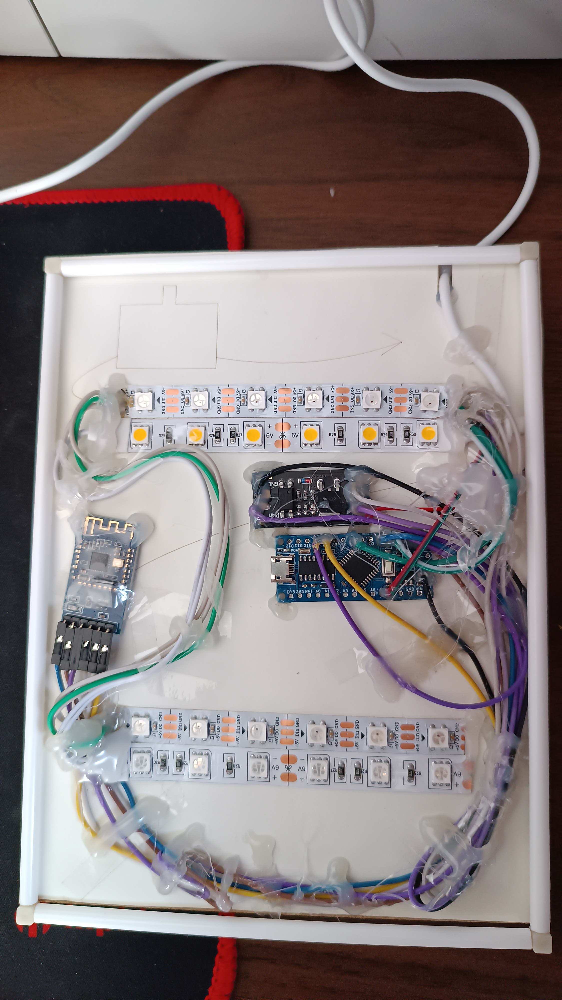
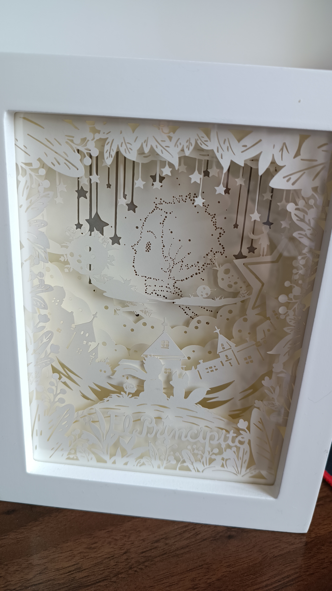
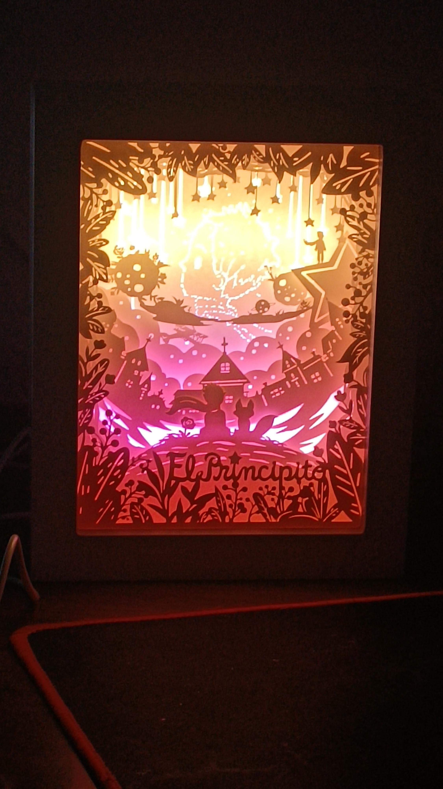
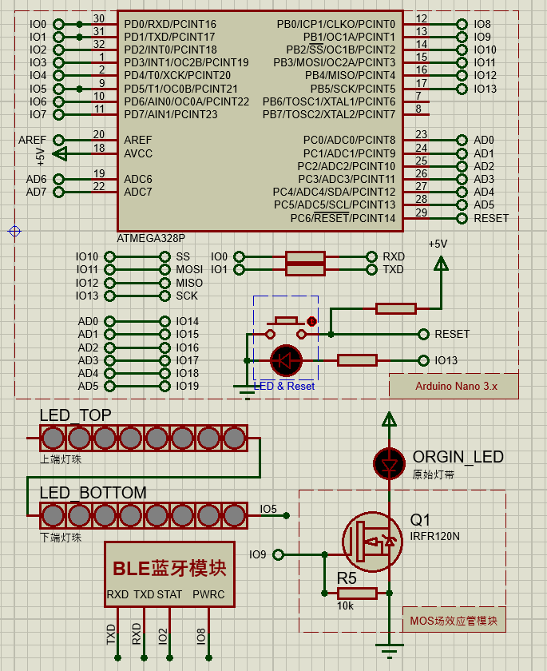

# 
纸雕灯DIY改造

## 项目介绍
本意是给对象送一个生日礼物，但是总觉得原版太单调，灯效也不够好看，于是自己设计改造了其中的电路，并使用微信小程序来控制。原计划加入更多功能，但由于时间紧凑以及考虑安全、稳定和实用性放弃了。

## 成品展示

## 纸雕灯改造内容
* 开发控制纸雕灯的微信小程序
* 定时关闭（关闭后单片机进入睡眠模式，重启后恢复）
* 自定义灯的亮度，自定义灯的颜色（共12颗灯珠，每一颗都可以单独控制颜色）
* 随时间渐变色效果（分上下两部分，可设置变化时间和起始结束色）
* 保留原始灯带，可选择打开原始灯带和WS2812LED灯带
* 灯带颜色和渐变色灯效可以持久保存，开机后自动恢复原有模式

## 所用材料
1. 基本焊接工具和导线
2. WS2812LED
3. JDY-18低功耗蓝牙模块（[用户手册链接](./资料/JDY-18蓝牙4.2模块JDY-18-V1.7.pdf)）
4. MOS场效应管（作为原始灯带的开关）
5. 国产芯片版Arduino Nano （[原理图链接](./资料/LGT328P-LQFP32-Nano.pdf)，淘宝连接https://m.tb.cn/h.UR5OvDF?tk=uyaYddSx0Hc） 
6. 纸雕灯DIY材料包（淘宝连接https://m.tb.cn/h.Uig1tGz?tk=yDGTddSCZ1M）

Arduino Nano本项目采用与之几乎完全兼容的国产版代替，其使用国产芯片LGT8F328P代替ATMEGA328P CH340芯片，功耗比原版更低，当然更重要的是价格更便宜，如果使用原版芯片的Arduino Nano，需要自行修改单片机代码中休眠部分使用的库与渐变色所用的定时器。

JDY-18低功耗蓝牙模块用在这里其实有些浪费了，可以用其它非常便宜的BLE蓝牙模块代替，用BLE蓝牙的原因是它待机功耗极低，可以一直保持通电，而且可以支持WebBluetooth（一开始考虑使用网页控制的），原打算以此做休眠唤醒功能，但是后来忘了，封装好之后才想起来，就放弃了。

## 项目原理图
**其中Proteus原理图仅可用于观察电路结构，不可用于仿真，其中蓝牙模块是我随手画的接口示意图没有仿真功能**

## 制作步骤
1. 通过AT指令修改BLE蓝牙模块波特率为115200。（也可以自己修改源码改成其它波特率或者用默认的9600波特率，这里修改波特率的原因主要是我用的国产芯片不知道为什么9600波特率串口通讯一直是乱码）
2. 通过AT指令修改设备名称为"Paper-Lamp"。（若不修改或者改成其它名称则需要修改小程序连接蓝牙设备的源码，我的代码设置的通过设备名来识别设备）
3. 通过AT指令关闭状态输出使能。（不关闭的话单片机会收到蓝牙模块发来的日志消息，会误读为指令）
4. （可选）通过AT指令关闭BLE蓝牙模块的LED指示灯，用电烙铁拆下单片机的电源指示灯和MOS场效应管模块的通路指示灯，这样防止这些灯亮影响纸雕灯的灯效。（也可以选择用不透明的胶带覆盖而非拆灯，但是拆灯也可以进一步降低整体的休眠功耗）
5. （可选）通过AT指令设置BLE蓝牙模块未连接时休眠，并关闭蓝牙模块RTC时钟（如果有RTC时钟的话），进一步降低整体的休眠功耗。
6. 将原始灯带的电源线，即USB公头连着开关一起剪下，WS2812LED灯带剪出两根6颗灯珠的灯带（共12颗灯珠）并用细长的导线连接在一起，一条贴在顶部一条贴在底部。
7. 按照原理图和电路图接线，安装，将上一步拆下的带开关的USB公头作为总电源，接线时注意该处的电流大小使用合适的导线。（其中STAT引脚最后未使用，可以不接）
8. 烧录单片机程序，固定，关键部分做好绝缘防短路，盖上后盖。
9. 微信小程序搜索“小王子纸雕灯”，或自行修改小程序源码后编译，打开控制小程序，连接设备即可控制纸雕灯。

AT指令详情见模块的用户手册。
